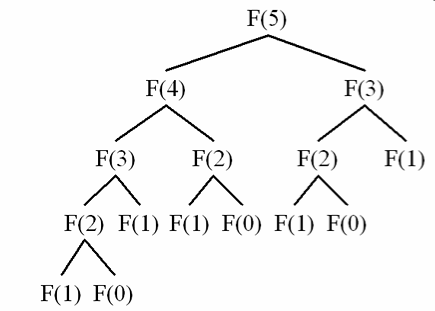

## Dynamic Programming ##
If you read the wikipedia for "dynamic programming", you found:
> "Dynamic programming is both a mathematical optimization method and a computer programming method"

which is right, because dynamic programming came from "Operations Research", and you can found applications across many different fields. The idea is similar tho:
> "simplifying a complicated problem by breaking it down into simpler sub-problems in a recursive manner"

but wait, it sounds almost the same as "divide and conquer"!

You are right, the main difference is when you divide complicated problems into sub-problems using divide conquer, those sub-problems doesnt overlapp with each other, they can be solved individually, and the **order doesnt matter**. *Sub problem1* doesnt need anything from *sub problem2*, vice versa. 

It like when your mom is forcing you to eat a 25 inch pizza in an hour, and you dont wanna die early because you are still waiting for the next season of your favorite anime to come out. You decided to cut it into slides and give them to your friends so that they can help u finishing it. Your friends just need to report to you that they had finished their own slide of pizza, the order doesnt matter, when they all reported, you can conclude that this pizza has been finished!

However in dynamic programming, the order matter! you are still dividing big problem into smaller sub problem, but it follows a pattern, let's use the  "fibonacci numbers" question as an example. You all know that in fibonacci number, f(n) = f(n - 1) + f(n - 2). And it works as the following:

```
F0  F1	F2	F3	F4	F5	F6	F7	F8	F9	F10	
0   1	1	2	3	5	8	13	21	34	55	

f(3) = f(3 - 1) + f(3 - 2)
f(3) = f(2) + f(1)
f(3) = 1 + 1
f(3) = 2
``` 

well, here we are dividing the f(3) into smaller sub-problem like f(3 - 1) + f(3 - 2) or f(2) + f(1), and the result of these two computations has to be calculated beforehand (before f(3) is calculated), you can see a chain of dependency here, f(3) is depending on f(2) and f(1), and f(2) is depending on f(1) and f(0).

There's two type of dynamic programming technique:
 - Top-down Dynamic Programming with Memoization 
 - Bottom-up Dynamic Programming

Top-down means that when we try to compute f(3), we dive into its dependency, f(2), if f(2) is depend on another one, we divide deeper until we hit the base case, in this example, f(1) and f(0) is our base case, after we hit the "bottom", we are starting to retrieve the infomation we got and it will help filling in the missing info [ f(3) = ? + ? => f(3) = 1 + 1 ].

Base case is usually the cases when the *algorithm can't divide it any further / it can't be calulated from the algorithm*, so we have to prefill it beforehand so it's not an infinite loop (think of tree travesal).


As you might imagine, "top down" really works like top - down, and it's usally implemented by recursion, and it looks like a tree. 



From the image we can tell some branches are identical to each other, it means the function with the same parameter is re-calculated multiple times[ why do it? the result is the same everytime! ; (  ]  and since we don't want to repeat ourselves, we can cache that result into memory, to prevent those wasted calculations. 

```[javascript]
    int cache[MAX] = {0};                       // big ** cache, it's like a mapping of "input -> f(input)" where input is the index, f(input) is value
    function f(int num) {
        if (num <= 1)                           // dont give me that NEGATIVE NUMNER!
            return n;
        // it's like adding more base cases, it will terminate any unesssary recursion 
        if (cache[num])                         // Do I have that result in my cache?
            return cache[num];                  // Yes I do! Let me give that sh*t to you, I am not gonna calculate that again!
        cache[num] = f(num - 1) + f(num - 2);   // OK bro, I am gonna ask my cousin f(num - 1) and f(num - 2) to do that elementary math for me
        return cache[num];                      // There you go, b***
    }
```

And if you have done at least one recursion before, you know that this so called top-down DP is just memorization plus the original brute force method.

```
int f(int n) 
{ 
    if (n <= 1) 
        return n; 
    return f(n-1) + f(n-2); 
} 
```

What about bottom up?

...OK.

In fact bottom up is the ultimate form of DP algorithm, and this is actually what you want to learn when you are doing DP problems[ because you already know how to brute force that poor little problem and you know how to add memorization, it's so easy that you don't even need to learn them  :( ]

Bottom up approach is a long story to tell, let me go get some coffee and teach you how to do it later (teleport back to the base)

<= to be continue
